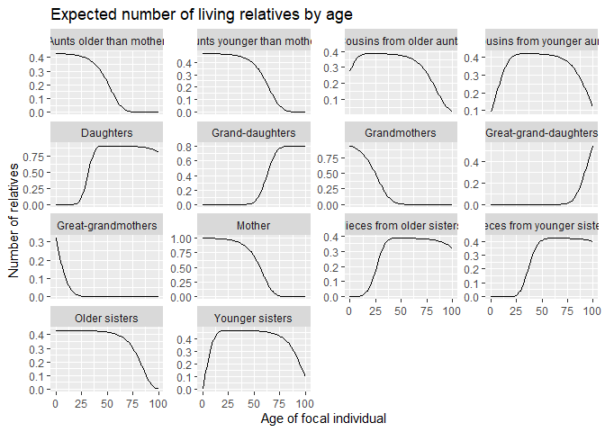

<!-- README.md is generated from README.Rmd. Please edit that file -->

# DemoKin

This is a package for estimating and characterize kin counts by type/age
of kin from a demographic perspective (Goodman, Keyfitz and Pullum,
1974; Caswell, 2019). It is giving its initial steps, so contact us for
any suggestion.

## Installation

You can install the development version from GitHub with:

``` r
# install.packages("devtools")
devtools::install_github("IvanWilli/DemoKin")
```

## Example

Thinking in a swedish female aged 50 in 2015, the expected kins are:

``` r
swe50_2015_stable <- kins(ego_age = 50, year = 2015,
                             P = swe_surv, asfr = swe_asfr,
                             stable = TRUE)

plot_diagramm(swe50_2015_stable[["kins_total"]],ego_age = 50)
```



For more details see `vignette("Use")`.

## Next steps:

  - Improve performance in `kins_non_stable` function.
  - Give an option to forecast mortality and fertility to locate Ego and
    relatives in the future.
  - Add functionalities to diagramm, like colors by kin degree and box
    size weighted by kin amount.
  - Add cumulative deaths by kin in the non-stable case, and also stage
    properties as Caswell (2020).
