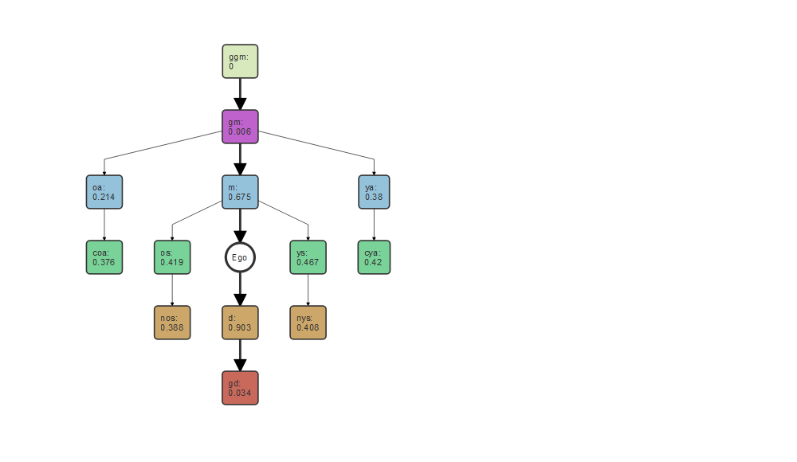

# DemoKin

<div class="columns">

<div class="column" width="60%">

`DemoKin` uses matrix demographic methods to compute expected (average)
kin counts from demographic rates under a range of scenarios and
assumptions. The package is an R-language implementation of Caswell
(2019, 2020, 2022), and Caswell and Song (2021). It draws on previous
theoretical development by Goodman, Keyfitz and Pullum (1974).

</div>

<div class="column" width="40%">


</div>

</div>

## Installation

You can install the development version from GitHub with:

``` r
# install.packages("devtools")
devtools::install_github("IvanWilli/DemoKin")
```

## Usage

Consider an average Swedish woman called ‘Focal’. For this exercise, we
assume a female closed population in which everyone experiences the
Swedish 2015 mortality and fertility rates at each age throughout their
life (the ‘time-invariant’ assumption in Caswell (2019)).

We then ask:

> How many living relatives does Focal have at each age?

Let’s explore this using the Swedish data already included with
`DemoKin`.

``` r
library(DemoKin)
swe_surv_2015 <- swe_px[,"2015"]
swe_asfr_2015 <- swe_asfr[,"2015"]
swe_2015 <- kin(p = swe_surv_2015, f = swe_asfr_2015, time_invariant = TRUE)
```

*p* is the survival probability by age from a life table and *f* are the
age specific fertility raties by age (see `?kin` for details).

Now, we can visualize the implied kin counts (i.e., the average number
of living kin) of Focal at age 35 using a network or ‘Keyfitz’ kinship
diagram with the function `plot_diagram`:

``` r
# We need to reformat the data a little bit
kin_total <- swe_2015$kin_summary
# Keep only data for Focal's age 35
kin_total <- kin_total[kin_total$age_focal == 35 , c("kin", "count_living")]
names(kin_total) <- c("kin", "count")
plot_diagram(kin_total, rounding = 2)
```



Relatives are identified by a unique code:

| DemoKin | Labels_female               |
|:--------|:----------------------------|
| coa     | Cousins from older aunts    |
| cya     | Cousins from younger aunts  |
| c       | Cousins                     |
| d       | Daughters                   |
| gd      | Grand-daughters             |
| ggd     | Great-grand-daughters       |
| ggm     | Great-grandmothers          |
| gm      | Grandmothers                |
| m       | Mother                      |
| nos     | Nieces from older sisters   |
| nys     | Nieces from younger sisters |
| n       | Nieces                      |
| oa      | Aunts older than mother     |
| ya      | Aunts younger than mother   |
| a       | Aunts                       |
| os      | Older sisters               |
| ys      | Younger sisters             |
| s       | Sisters                     |

## Vignette

For more details, including an extension to time varying-populations
rates, deceased kin, and multi-state models in a one-sex framework, see
`vignette("Reference_OneSex", package = "DemoKin")`. For the case of
two-sex see `vignette("Reference_TwoSex", package = "DemoKin")`. If the
vignette does not load, you may need to install the package as
`devtools::install_github("IvanWilli/DemoKin", build_vignettes = T)`.

## Citation

Williams, Iván; Alburez-Gutierrez, Diego; Song, Xi; and Hal Caswell.
(2021) DemoKin: An R package to implement demographic matrix kinship
models. URL: <https://github.com/IvanWilli/DemoKin>.

## Acknowledgments

We thank Silvia Leek from the Max Planck Institute for Demographic
Research for designing the DemoKin logo. The logo includes elements that
have been taken or adapted [from this
file](https://commons.wikimedia.org/wiki/File:Escudo_de_la_Orden_de_San_Jer%C3%B3nimo.svg),
originally by Ansunando, [CC BY-SA
4.0](https://creativecommons.org/licenses/by-sa/4.0) via Wikimedia
Commons. Sha Jiang provided useful comments for improving the package.

## Get involved!

`DemoKin` is under constant development. If you’re interested in
contributing, please get in touch, create an issue, or submit a pull
request. We look forward to hearing from you!

## References

Caswell, H. 2019. The formal demography of kinship: A matrix
formulation. Demographic Research 41:679–712.

Caswell, H. 2020. The formal demography of kinship II: Multistate
models, parity, and sibship. Demographic Research 42: 1097-1144.

Caswell, Hal and Xi Song. 2021. “The Formal Demography of Kinship. III.
Kinship Dynamics with Time-Varying Demographic Rates.” Demographic
Research 45: 517–46.

Caswell, H. (2022). The formal demography of kinship IV: Two-sex models
and their approximations. Demographic Research, 47, 359–396.

Goodman, L.A., Keyfitz, N., and Pullum, T.W. (1974). Family formation
and the frequency of various kinship relationships. Theoretical
Population Biology 5(1):1–27.
