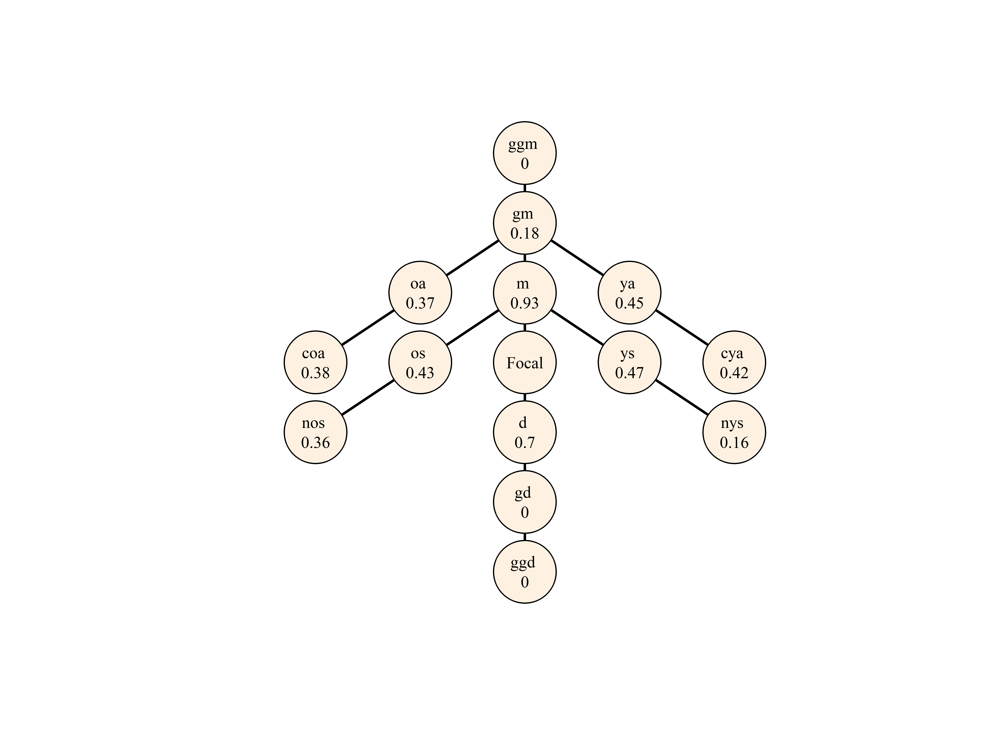

<!-- README.md is generated from README.Rmd. Please edit that file -->

# DemoKin

This package uses matrix demographic methods to estimate living and
death kin counts, and their age distribution by type of relative in
stable and non-stable populations. The package is a free-based
implementation of Caswell (2019) and draws on previous theoretical
development by Goodman, Keyfitz and Pullum (1974). `DemoKin` is giving
its first steps, so please contact us, create an issue or submit a pull
request if you have any suggestion.

## Installation

You can install the development version from GitHub with:

``` r
# install.packages("devtools")
devtools::install_github("IvanWilli/DemoKin")
```

## Example

Consider an average Swedish woman aged 50 in year 2015, called more
generally Ego. The types of Ego’s relatives included in this package
follows this abbreviation list:

| Code | Relative                                   |
| :--- | :----------------------------------------- |
| coa  | Cousins (through aunt older than mother)   |
| cya  | Cousins (through aunt younger than mother) |
| d    | Daughter                                   |
| gd   | Grand-daughter                             |
| ggm  | Great-grandmother                          |
| gm   | Grandmother                                |
| m    | Mother                                     |
| nos  | Nieces through older sister                |
| nys  | Nieces through younger sister              |
| oa   | Aunt older than mother                     |
| ya   | Aunt younger than mother                   |
| os   | Older sister                               |
| ys   | Younger sister                             |

How many female relatives can this woman expect to have? Following the
Swedish woman example, we can assume demographic stability (i.e., assume
that the woman and her relatives experienced the mortality and fertility
rates from 2015 at each age throughout their life, in a female closed
population):

``` r
library(DemoKin)
swe50_2015_stable <- kins(ego_age = 50, year = 2015,
                             P = swe_surv, asfr = swe_asfr,
                             stable = TRUE)
```

Where *P* is the survival ratio by age from a life table and *asfr* are
the age specific fertility ratios by age (simple ages allowed at the
moment). A network-diagram shows expected living kins for Ego:

``` r
plot_diagram(swe50_2015_stable[["kins_total"]])
```



For more details, including an extension to non-stable populations and
relative´s death distribution, see `vignette("Use")`.

## Citation

Williams, Iván and Diego Alburez-Gutierrez. (2021) DemoKin: An R package
to estimate kinship networks in stable and non-stable populations. URL:
<https://github.com/IvanWilli/DemoKin>.

## References

Caswell, H. (2019). The formal demography of kinship: A matrix
formulation. Demographic Research 41:679–712.
<doi:10.4054/DemRes.2019.41.24>.

Goodman, L.A., Keyfitz, N., and Pullum, T.W. (1974). Family formation
and the frequency of various kinship relationships. Theoretical
Population Biology 5(1):1–27. <doi:10.1016/0040-5809(74)90049-5>.

## Next steps:

  - Improve performance of `kins_non_stable` function (takes \~ 5 min).
  - Add more functionalities to the diagram, like colors by kin degree
    and box size weighted by kin amount.
  - Add stage properties as in Caswell (2020).
